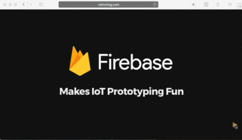

# The Internet of NodeBots

Do you know what’s cool? Robots. Do you know what’s cooler than robots? Internet aware robots that run JavaScript. 

Jenny will show you how easy it is to combine node.js, commodity hardware, and the Internet of Things to build awesome little robotic friends. This session will include both live coding and live robot building.

Slides live on [mimming.com](https://mimming.com/presos/internet-of-nodebots/)

## About the deck

Forked from the wonderful [reveal.js](https://github.com/hakimel/reveal.js)
The talk implements the [FireButton project](https://github.com/mimming/firebutton)

## License

Apache 2.0

Copyright (C) 2017 Google, Inc.
